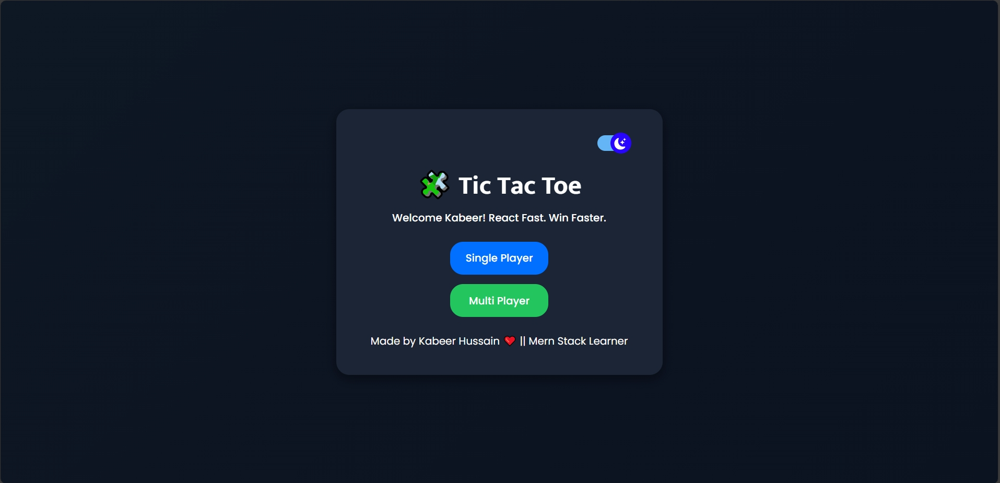

# 🕹️ Tic Tac Toe Game
**Live Demo:** [Tic Tac Toe](https://tic-tac-toe-by-kabeer-hussain.vercel.app/)

A **responsive and modern Tic Tac Toe game** built using **HTML, CSS & JavaScript**.  
Includes **Single Player** and **Double Player** modes with interactive buttons, light/dark theme toggle, and smooth animations for professional UI.

---

## 🚀 Features

### 🎯 Game Modes

- **Single Player:** Play against the computer  
- **Double Player:** Play against a friend  
- **Light/Dark Theme Toggle:** Switch between themes easily

---

### 🧩 Interactive Game System

- Highlights **active player**  
- Winner and draw messages displayed clearly  
- Dynamic box animations on hover  
- Restart and New Game buttons for smooth navigation  

---

### 🎨 Single Shared CSS

- One global `style.css` keeps UI consistent  
- Light/Dark theme colors controlled via CSS variables  
- Modern design using gradients, shadows, and smooth hover effects  

---

### 🖱️ Complete Navigation

- **Single Player Mode:** Shows player turns dynamically  
- **Double Player Mode:** Switches between players automatically  
- Restart / New buttons reset the game easily  

---

### 🏆 Winner Display

- Highlights winning boxes  
- Shows winner or draw message  
- Animations for winning line  

---

### 📁 Folder Structure

```css
tic-tac-toe/
│── index.html
│── single.html
│── double.html
│── app.js
│── single.js
│── double.js
│── style.css
│── assets
│── sounds
│── README.md

```

---

### 💡 How It Works

1. Player selects `Single Player or Double Player` mode
2. Game grid is rendered dynamically using `script.js`
3. Player clicks on boxes → `X` or `O` is placed
4. Active player highlighted using .active-player class
5. Winner detected by `checkWinner()` function → winner line displayed
6. `Restart / New Game button` clears the board and resets variables

---

### 🎉 Why This Project Is Special

- Responsive UI: Works on desktop and mobile
- Light/Dark Themes: Modern color switch
- Interactive Buttons: Shiny hover and click effects
- Winner Highlighting: Professional visual feedback
- Easy to Extend: Add AI improvements or new features

---

### 💡 Learning Goals

- DOM Manipulation
- Event Handling in JavaScript
- CSS Variables & Theming
- Dynamic UI Rendering
- Game Logic Implementation

---

### 📸 Preview

**

---

### 🛠️ Developer Info

👨‍💻 **Developer:** Kabeer Hussain  
📘 **Series:** JavaScript — 30 Days, 30 Projects  
📆 **Day:** 9 — Tic Tac Toe Game 
📧 **Email:** codealpha0786@gmail.com  
🔗 **GitHub:** [ITechKabeer](https://github.com/ITechKabeer)

Made  by Kabeer Hussain ❤️
